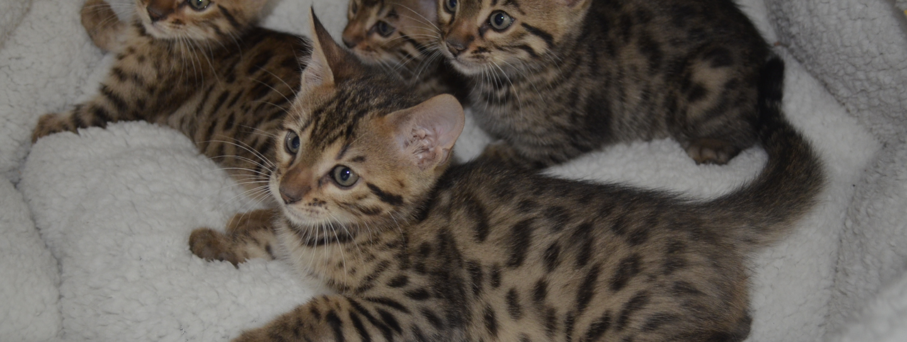

# Kingbengals Website

Kingbengals Cattery is a family operated local cattery in Sacramento, specialized in breeding the exotic Bengal cats. However, they relied on third party sites to advertise their kittens and make sales. This website for Kingbengals Cattery provides the business their own internet platform to properly advertise their Bengal kittens for sales and expand their business in the process.



# Contents

- [Synopsis](#Synopsis) 
- [Testing](#Testing)
- [Deployment](#Deployment)
- [Instructions](#Instructions)

## Synopsis

### Testing

- Describe any prerequisites, libraries, OS version, etc., needed before installing program.
- ex. Windows 10

### Deployment

- How/where to download your program
- Any modifications needed to be made to files/folders

```
code blocks for commands
```

### Instructions

- How to run the program
- Step-by-step bullets

### Figma Prototype Images of Website

<table>
  <tr>
     <td>Home Page</td>
     <td>Reserve A Kitten Page</td>
     <td>Our Cats Page</td>
  </tr>
  <tr>
    <td></td>
    <td></td>
    <td></td>
  </tr>
  <tr>
     <td>About Us Page</td>
     <td>Reviews Page</td>
     <td>Litter Updates Page</td>
  </tr>
  <tr>
    <td></td>
    <td></td>
    <td></td>
  </tr>
  <tr>
     <td>Litter Updates Page: Litter Info View</td>
     <td>Litter Updates Page: Kitten Info View</td>
     <td>Breed Info Page</td>
  </tr>
  <tr>
    <td></td>
    <td></td>
    <td></td>
  </tr>
  <tr>
    <td>Contact Us Page</td>
  </tr>
  <tr>
    <td></td>
  </tr>
 </table>

## Timeline

### Milestones

## Authors

- Andres Morocho
- Abdelrahman Said Yousef Ahmed Mohamed
- Ben Pennington
- Chris Mataragas
- Joshi Ventura Leon
- Mahdi Noureddine
- Mehakdeep Singh
- Wesley Wang
