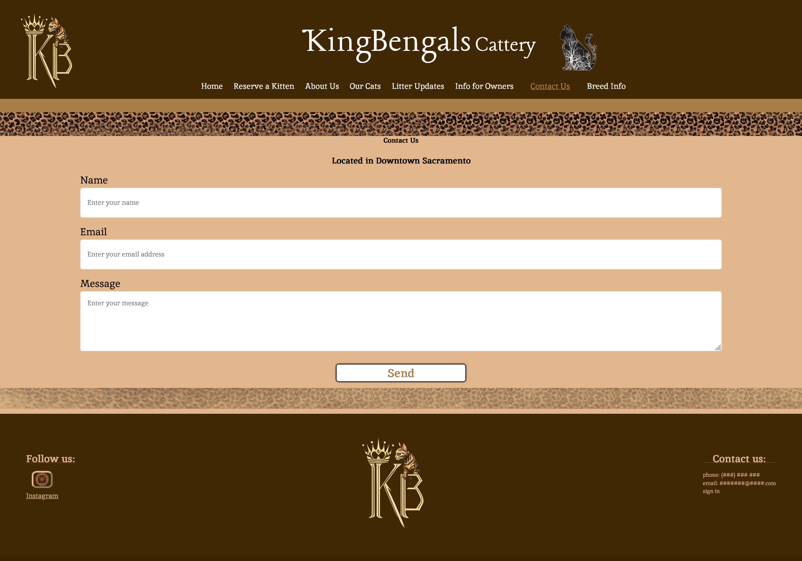

# Kingbengals Website

Kingbengals Cattery is a family operated local cattery in Sacramento, specialized in breeding the exotic Bengal cats. However, they relied on third party sites to advertise their kittens and make sales. This website for Kingbengals Cattery provides the business their own internet platform to properly advertise their Bengal kittens for sales and expand their business in the process.


# Contents

- [Synopsis](#Synopsis) 
- [Testing](#Testing)
- [Deployment](#Deployment)
- [Instructions](#Instructions)
- [Prototype](#Prototype)
- [Timeline](#Timeline)
- [Milestones](#Milestones)
- [Authors](#Authors)

## Synopsis

### Testing

### Deployment
  Deployed via www.godaddy.com
- How/where to download your program

- Any modifications needed to be made to files/folders

```
code blocks for commands
```

### Instructions

To run the website, a internet browser of your choice must be installed.
Program can be accessed by navgating to http://www.kingbengalscattery.com from your preferred browser. The website should appear. From there you may navigate the website using the links on the header, or if you are on mobile, by using the drop down menu from the top right side of the page.

### Prototype

<table>
  <tr>
     <td>Home Page</td>
     <td>Reserve A Kitten Page</td>
     <td>Our Cats Page</td>
  </tr>
  <tr>
    <td></td>
    <td></td>
    <td></td>
  </tr>
  <tr>
     <td>About Us Page</td>
     <td>Info For Owners</td>
     <td>Litter Updates Page</td>
  </tr>
  <tr>
    <td></td>
    <td></td>
    <td></td>
  </tr>
  <tr>
     <td>Litter Updates Page: Litter Info View</td>
     <td>Contact Us Page</td>
     <td>Breed Info Page</td>
  </tr>
  <tr>
    <td></td>
    <td></td>
    <td></td>
  </tr>

 </table>

## Timeline
<table>
  <tr>
    <td>Sprint 5</td>
    <td>Sprint 6</td>
    <td>Sprint 7</td>
    <td>Sprint 8</td>
    <td>Sprint 9</td>
    <td>Sprint 10</td>
  </tr>
  <tr>
    <td>Complete the UI for the website.</td>
    <td>Add functionallity to all buttons and links.</td>
    <td>Implement an API for a chosen interest.</td>
    <td>Establish a database for storing images.</td>
    <td>Complete admin login and editing capabilities.</td>
    <td>Web hosting and domain created.</td>
  </tr>
</table>

## Authors

- Andres Morocho
- Abdelrahman Said Yousef Ahmed Mohamed
- Ben Pennington
- Chris Mataragas
- Joshi Ventura Leon
- Mahdi Noureddine
- Mehakdeep Singh
- Wesley Wang
